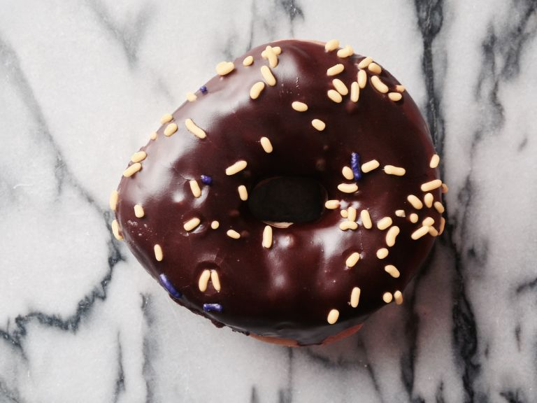
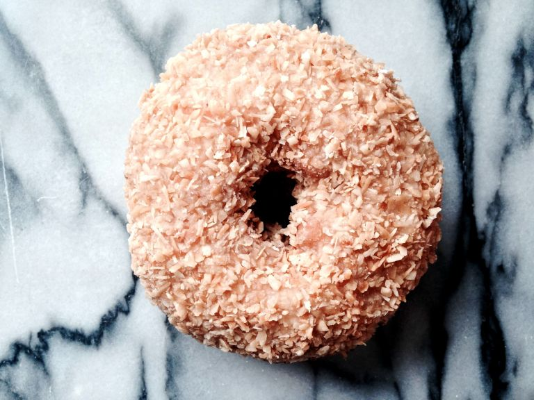
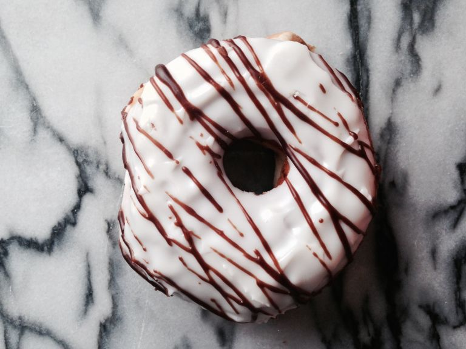

# Design Assets
Early in the development process, you realize that your capabilities
with computer software does not extend to Adobe Illustrator.  Likewise,
you decide to hire a famous design firm to create your logo and other
design resources:

#### Color Scheme

#### Logo

  <a href="../../assets/images/dronut.ai">
    
    <label>
      Logo (Illustrator)
    </label>
  </a>
  <a href="../../assets/images/logos/dronut.png">
    
    <label>
      Logo (PNG)
    </label>
  </a>
  <a href="../../assets/images/dronut-favicon.zip">
    
    <label>
      Favicons (ICO)
    </label>
  </a>

#### Example Donut Menu

  

    
    <label> Apple Krumb </label>
  

  

    
    <label> Bavarian Kreme </label>
  

  

    
    <label> Blueberry </label>
  

  

    
    <label> Boston Kreme </label>
  

  

    
    <label> Chocolate Frosted </label>
  

  

    
    <label> Chocolate Glaze </label>
  

  

    
    <label> Chocolate Kreme </label>
  

  

    
    <label> Cinnamon Sugar </label>
  

  

    
    <label> Coconut </label>
  

  

    
    <label> Cruller </label>
  

  

    
    <label> Jelly </label>
  

  

    
    <label> Marble Frosted </label>
  

  

    
    <label> Old Fashioned </label>
  

  

    
    <label> Original Glaze </label>
  

  

    
    <label> Powdered Sugar </label>
  

  

    
    <label> Sour Cream </label>
  

  

    
    <label> Strawberry Frosted </label>
  

  

    
    <label> Vanilla Frosted </label>
  

